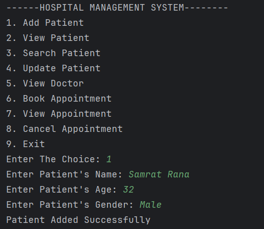
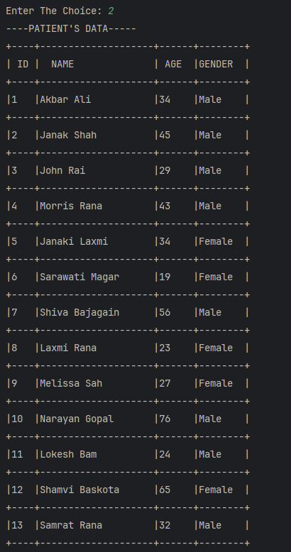
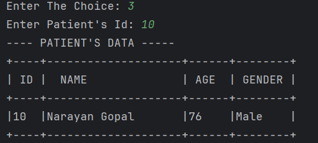
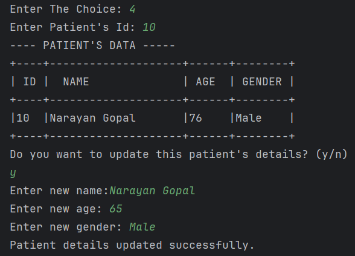
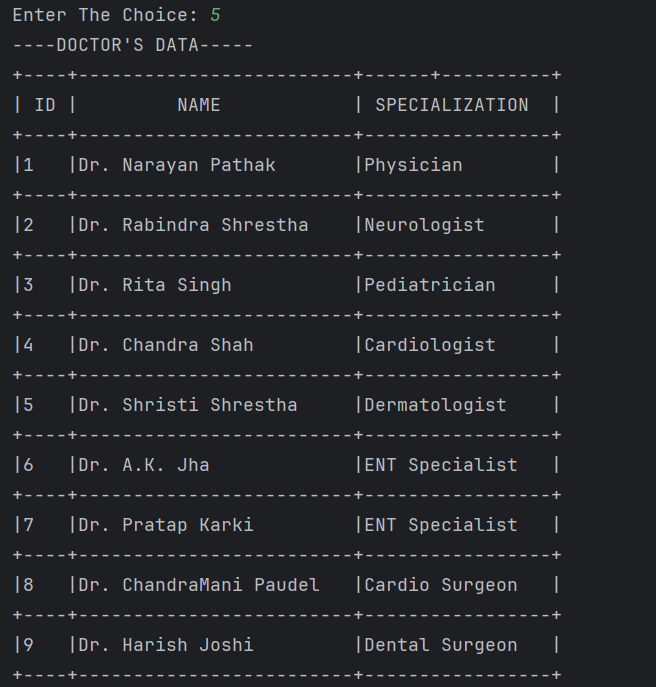
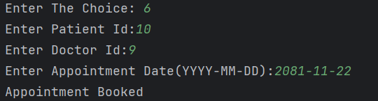
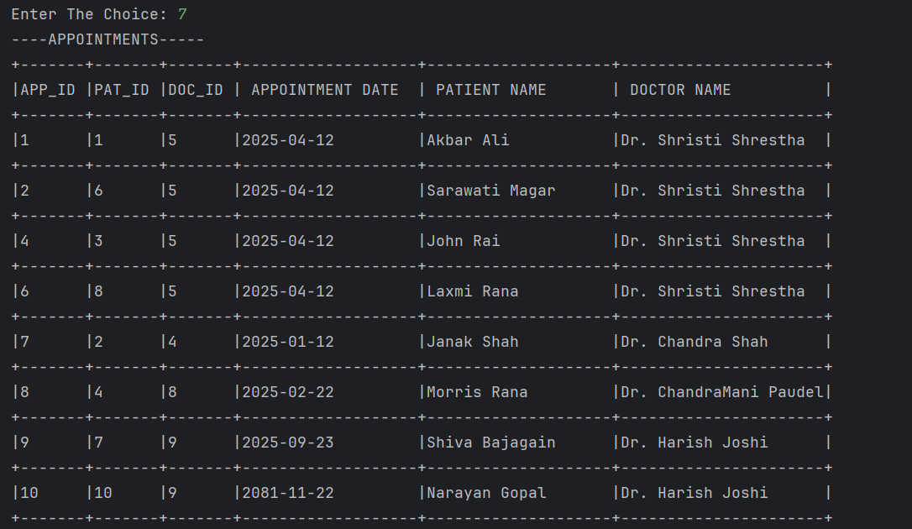
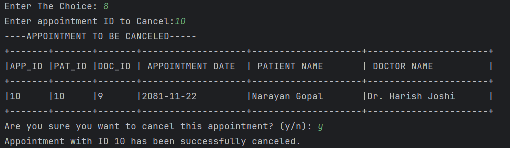

<h1>Hospital Management System</h1>

<p>A Java-based application designed primarily for receptionists to manage patient records, doctor information, and appointments in a hospital setting. It uses MySQL for database management and offers a console-based interface.</p>

<h2>Features</h2>

<ul>
    <li>Patient Management: Add, view, search, and update patient records.</li>
    <li>Doctor Information: View details about available doctors.</li>
    <li>Appointment Scheduling: Book, view, and cancel appointments.</li>
</ul>

<h2>Technologies Used</h2>

<ul>
    <li>Programming Language: Java</li>
    <li>Database: MySQL</li>
    <li>Libraries: JDBC</li>
</ul>

This project requires the `SQLConnector` JAR file for database connectivity. Please ensure that the JAR is included in the classpath before running the project.

## Step 1: Download the SQLConnector JAR

You can download the SQLConnector JAR file from the official website or repository of the database you're using. For example, if you're using MySQL, you will need the [MySQL Connector/J](https://dev.mysql.com/downloads/connector/j/).

- Download the JAR file from the link above or any other source that provides the appropriate JDBC driver for your database.

## Step 2: Add SQLConnector JAR to Your Project

### For IntelliJ IDEA:

1. Open your project in IntelliJ IDEA.
2. Right-click on the project folder or `lib` directory (if you have one).
3. Select **Add as Library**.
4. Browse to the location where you saved the `SQLConnector` JAR file, and select it.
5. The JAR will be added to your project's classpath.

## Step 3: Create Database
```bash
CREATE DATABASE hospitalmanagementsystem;

USE hospitalmanagementsystem;

-- Create the patient table
CREATE TABLE patient (
id INT AUTO_INCREMENT PRIMARY KEY,
name VARCHAR(100) NOT NULL,
age INT NOT NULL,
gender VARCHAR(10) NOT NULL
);

-- Create the doctor table
CREATE TABLE doctor (
id INT AUTO_INCREMENT PRIMARY KEY,
name VARCHAR(100) NOT NULL,
specialization VARCHAR(100) NOT NULL
);

-- Create the appointment table
CREATE TABLE appointment (
id INT AUTO_INCREMENT PRIMARY KEY,
patient_id INT NOT NULL,
doctor_id INT NOT NULL,
appointment_date DATE NOT NULL,
FOREIGN KEY (patient_id) REFERENCES patient(id),
FOREIGN KEY (doctor_id) REFERENCES doctor(id)
);

```

## Step 4: Insert sample doctor data since receptionists have no access

```bash
INSERT INTO doctor (name, specialization) VALUES
('Dr. Narayan Pathak', 'Physician'),
('Dr. Rabindra Shrestha', 'Neurologist'),
('Dr. Rita Singh', 'Pediatrician'),
('Dr. Chandra Shah', 'Cardiologist'),
('Dr. Shristi Shrestha', 'Dermatologist'),
('Dr. A.K. Jha', 'ENT Specialist'),
('Dr. Pratap Karki', 'ENT Specialist'),
('Dr. ChandraMani Paudel', 'Cardio Surgeon'),
('Dr. Harish Joshi', 'Dental Surgeon');
```

## Screenshots
<h3>1.Add Patient</h3>

<h3>2.View Patients</h3>

<h3>3.Search Patients</h3>

<h3>4.Update Patients</h3> 

<h3>5.View Doctors</h3>

<h3>6.Book Appointment</h3>

<h3>7.View Appointment</h3>

<h3>8.Cancel Appointments</h3>


